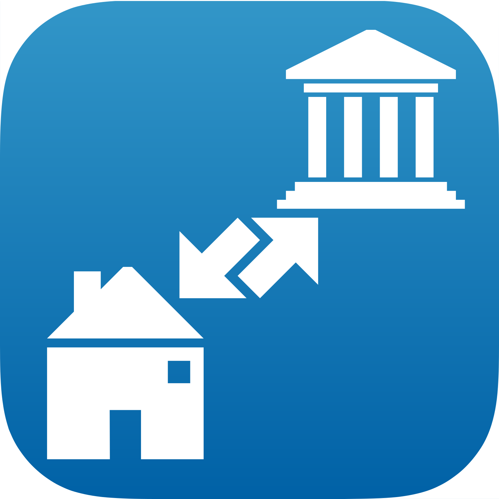
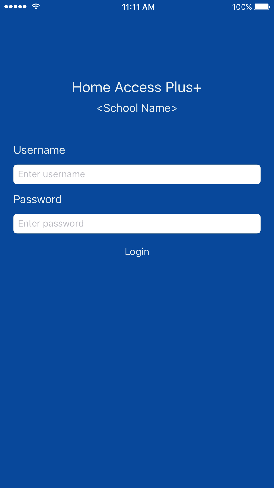
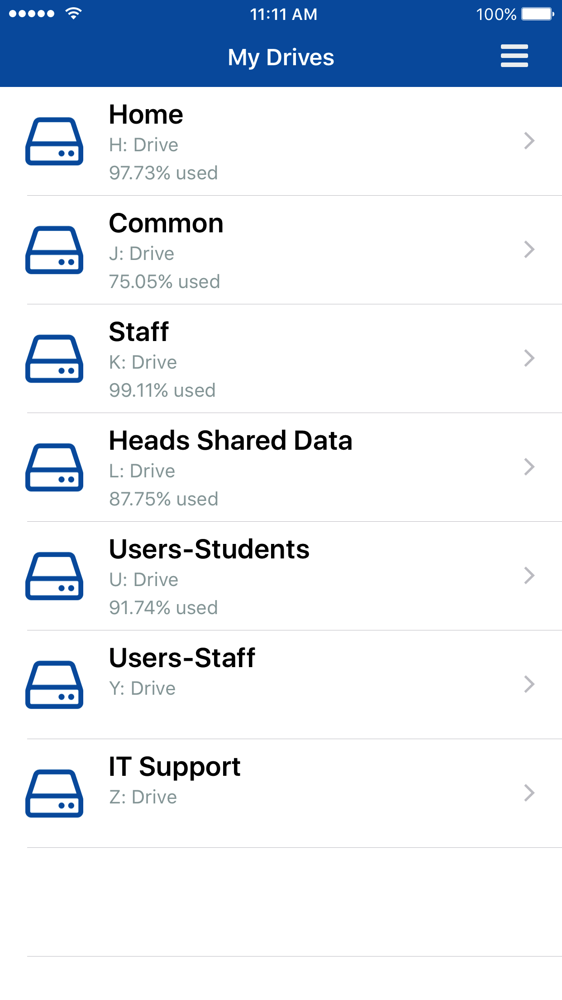
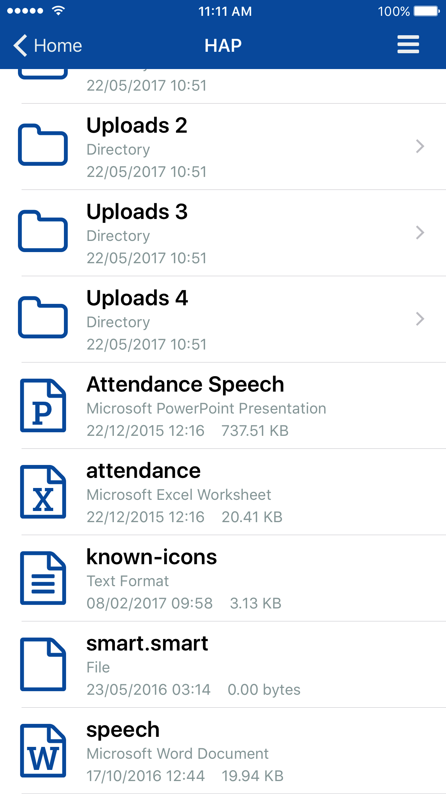
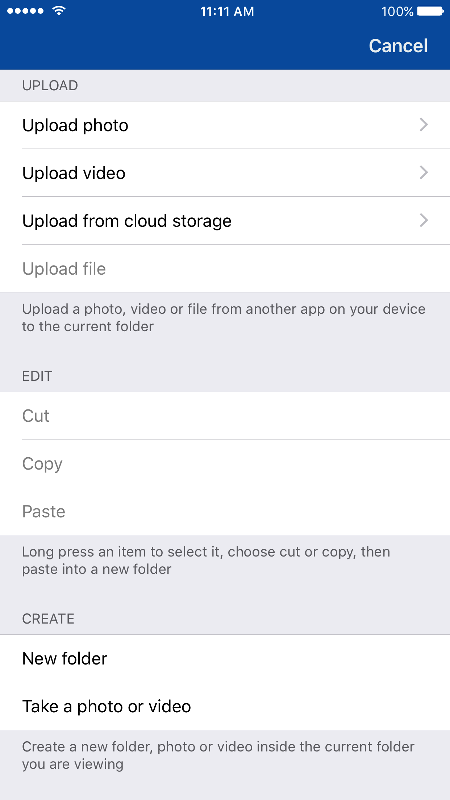
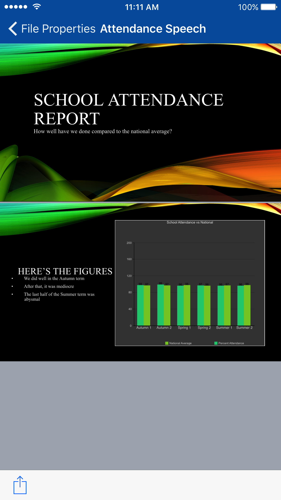

    

# Home Access Plus+ for iOS

Home Access Plus+ (HAP) for iOS provides a native app to connect your Apple device to your institutions [Home Access Plus+](https://hap.codeplex.com) server. You can then browse, upload and download files easily to and from your iOS device to your institution network file drives. A [demo video](https://www.youtube.com/watch?v=cpr7Ar-a5MA) and [additional screenshots](https://goo.gl/photos/6Ptp4J1woojWuUik9) are available to view of the app in action (version 0.5.0).

## Requirements
To be able to use this app, you will need to have the following:
* A device running iOS 9.0+
* [Home Access Plus+](https://hap.codeplex.com) set up and running for your institution (bug your network managers to get this set up&hellip; it's free)

## Frequently Asked Questions
Before asking for help or reporting a bug, please read through the [Frequently Asked Questions](FAQ.md) to see if the problem can be resolved.

## Contributing
Thanks for your interest in contributing to this project. You can contribute or report issues in the following ways:

### Beta Testing
* [Sign up for beta testing](http://www.edugeek.net/forums/home-access-plus/164699-home-access-plus-ios-app-request-testers.html) to explore and test the app through [Testflight](https://developer.apple.com/testflight/)
* [Download a release](https://github.com/stuajnht/HAP-for-iOS/releases) or [clone the latest](https://github.com/stuajnht/HAP-for-iOS.git) code and run it on your own device ([Xcode](https://developer.apple.com/xcode/) is needed to build the project)

### Reporting Issues
* [Report a bug](http://issuetemplate.com/#/stuajnht/HAP-for-iOS/bug) if something isn't working as you expect it to
* [Suggest an improvement](http://issuetemplate.com/#/stuajnht/HAP-for-iOS/request) for something that you'd like to see

### Pull Requests
If you would like to create a pull request, please make sure that you are on the [develop branch](https://github.com/stuajnht/HAP-for-iOS/tree/develop) before opening one. Once you have cloned or forked this repo, open the `HomeAccessPlus.xcworkspace` file in Xcode to begin development. This project uses [git-flow](https://github.com/nvie/gitflow) as its branching model.

The current development environment is with Xcode 8.2 and Swift 3.0.2. Please make sure you are using these versions before submitting any pull requests

### Contributors
The following users have contributed code or suggestions to this project:
* [@TestValleySchool](https://github.com/TestValleySchool):
  * [#19](https://github.com/stuajnht/HAP-for-iOS/pull/19)
* [kidpressingbuttons](http://www.edugeek.net/members/kidpressingbuttons.html)

## Privacy Purpose Permissions
Apps built for iOS 10+ must declare the purpose for access to any user private data types (sources: [1](http://useyourloaf.com/blog/privacy-settings-in-ios-10/), [2](https://developer.apple.com/videos/play/wwdc2016-709/?time=1470), [3](https://developer.apple.com/videos/play/wwdc2016-709/?time=1780)). Since this project uses the [PermissionScope Cocoapod](#cocoapods) a number of additional unused permissions are requested ([GitHub Issue](https://github.com/nickoneill/PermissionScope/issues/194)). Please see the [Frequently Asked Questions](FAQ.md#why-are-so-many-privacy-purpose-permissions-needed) for more information.

## License Terms
Home Access Plus+ for iOS is publised under the GNU GPL v3 License, see the [LICENSE](LICENSE.md) file for more information.

The name "Home Access Plus+" and all server side code are copyright Nick Brown ([nb development](https://nbdev.uk/projects/hap.aspx))

### Cocoapods
This project uses Cocoapods. Their project source code pages and licenses can be found below:
* [Alamofire](https://github.com/Alamofire/Alamofire/)
* [ChameleonFramework](https://github.com/ViccAlexander/Chameleon)
* [DKImagePickerController](https://github.com/zhangao0086/DKImagePickerController)
* [Font Awesome Swift](https://github.com/Vaberer/Font-Awesome-Swift)
* [Locksmith](https://github.com/matthewpalmer/Locksmith)
* [MBProgressHUD](https://github.com/jdg/MBProgressHUD)
* [PermissionScope](https://github.com/nickoneill/PermissionScope)
* [SwiftyJSON](https://github.com/SwiftyJSON/SwiftyJSON)
* [XCGLogger](https://github.com/DaveWoodCom/XCGLogger)
* [Zip](https://github.com/marmelroy/Zip)

### Other Projects
The following projects and source code are included in HAP+ for iOS. Their licenses project pages can be found below:
* [Reach](https://github.com/Isuru-Nanayakkara/Reach)

## To-Do List
The following features are planned for the Home Access Plus+ iOS app, along with their expected releases (which can change).

### 1.0.0
* ~~Long press a table item to select it or choose cut / copy functions, and paste into new folder~~
* ~~Disable writing files and folders if the user does not have the permission to, by disabling items in the upload popover~~
* ~~Update icon so that the ‘house’ isn’t as close to the bottom corner~~

### 1.1.0
* "Favourite" folders for devices in personal or single mode, using a tab bar to select between the my files or favourites "views" -- the use of swiping the table row right to select items could be used to show a favourite button
* Create a zip file from any selected items items
* (Optional branding) Set a logo and theme (including app icon) colour based on those used by the school to use throughout the app -- information possibly collected by accessing a app-config.json file located on the HAP+ server somewhere
* Support for document provider open and move options for apps that do not support import and export -- possibly won't happen, as all attempts to get this working so far haven't been successful
